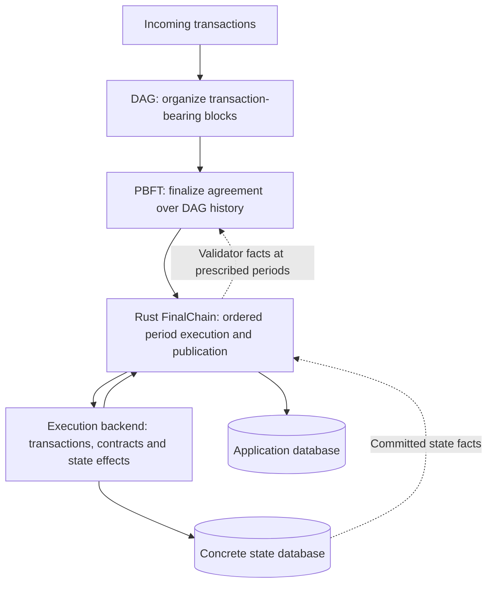

# Architecture overview: consensus, execution, state and REVM

This overview describes the current **Rustaxa rewrite**, where consensus/application and FinalChain ownership have
already moved substantially into Rust. The `taraxa-evm` Go component is broader than an interpreter: it also supplies
transaction processing, native execution, temporary state, trie commitments and concrete database persistence.
The [direction decision](07_direction_decision.md) selects a replacement architecture; it does not activate it.

## From agreement to committed state

A period connects finalized PBFT history to FinalChain execution. Network/pool code receives and distributes
transactions; the DAG organizes blocks and dependencies; PBFT establishes final agreement. FinalChain prepares
ordered execution inputs, coordinates system operations and rewards, validates results, and publishes finalized
records. Execution determines transaction effects. A finalized transaction can still fail during execution.
Staking changes feed future validator eligibility/voting facts back into consensus at protocol-defined periods and
delays; the interpreter itself never chooses DAG ordering or authorizes publication.

For a contract call, the backend applies Taraxa's nonce/funds/gas rules, runs bytecode, and stages account/storage
changes. The interpreter asks its host for state and yields child-call requests. Frame settlement handles gas,
logs, return values and rollback. After the required period processing, the backend computes the state root and
FinalChain coordinates persistence of matching state and finalized records. Queries must see a committed generation,
not partially staged execution. See the [execution port](../../rust/crates/rustaxa-consensus/src/consensus_application_runtime.rs)
and [FinalChain execution lifecycle](../../rust/crates/rustaxa-consensus/src/final_chain_execution.rs).

## Data, commitments and physical databases

| Application data | Concrete execution state |
| --- | --- |
| DAG/PBFT records and metadata | Account balances and nonces |
| Finalized headers, transactions, receipts and indexes | Contract bytecode and storage |
| Rust native snapshots and publication/recovery records | Exact native storage bytes, trie nodes and historical state versions |

Native contracts are built-in protocol functions, such as staking, invoked through designated addresses rather than
ordinary contract bytecode. Rust's structured validator/delegation snapshots express domain state; concrete native
storage preserves the exact bytes contributing to the commitment. Those snapshots cannot reconstruct arbitrary
contract storage or all historical native rows.

The commitment hierarchy is `storage values → per-account storage root → account trie → global state root`.
Account commitment fields include nonce, balance, storage root and code hash. The root commits to state but cannot
reconstruct it. RocksDB stores records; Taraxa's trie/encoding rules determine what is hashed. Its physical account
record also includes code size, which is absent from the account commitment encoding. See the
[state and codec assessment](03_state_migration_validation.md#state-codecs-and-physical-layout).

Both application data and execution state remain necessary long term. **Two physical databases are optional.**
The current `db/` and `state_db/` layout requires coordinated publication/recovery because separate RocksDB writes
are not one atomic commit. Keeping that layout initially simplifies reference comparison and migration; it is not
a REVM requirement or a permanent architecture conclusion. The task owner has selected preservation of the
existing layout for this implementation; consolidation is deferred. The
[implementation plan](08_implementation_plan.md) makes this constraint explicit. A later consolidation could use
cross-column-family atomic batches, but would need separate migration, shared-resource, durability, pruning and
rollback validation. RocksDB documents the underlying
[column-family guarantees](https://github.com/facebook/rocksdb/wiki/Column-Families).
Physical consolidation need not change consensus-visible state roots or adopt Ethereum account encoding.

## Current and proposed execution paths

| Layer | Current Rustaxa path | Proposed Rust/REVM path |
| --- | --- | --- |
| Protocol orchestration | Rust consensus application and FinalChain | Preserve existing ownership |
| Concrete execution boundary | Rust port → C++ `ExternalEvmStateOwner`/`StateAPI` → Go | Rust adapter behind the existing application boundary |
| Transaction/frame policy | Taraxa Go envelope, calls, gas and rollback | Rustaxa-owned compatible rules and journals |
| Bytecode instructions | Taraxa's fork-owned Go interpreter | Pinned REVM interpreter with explicit Taraxa profile |
| Native operations | Go concrete execution plus existing Rust domain logic/validation | Adapters invoke existing Rust kernels and serialize exact mutations |
| Concrete state | Go account/storage views, trie and RocksDB backend | Rust views, exact codecs, incremental writer and persistence |

Go still produces concrete execution state even for native-only periods. Existing Rust native kernels are valuable
business logic, but are not yet a complete byte-exact execution/storage adapter. The current
[concrete owner](../../libraries/core_libs/consensus/src/application/external_evm_state_owner.cpp) also serves state
queries, simulation and tracing; these execution-facing responsibilities must migrate too.

REVM is a library inside the replacement backend. For `ADD`, it performs arithmetic; for `SLOAD`, it requests a
value from the host; for `SSTORE`, the host records the state effect; for `CALL`, the frame driver handles a child,
including native dispatch; for `CREATE`, Rustaxa retains authority over wide nonce/address/account lifecycle rules.
REVM does not replace consensus, FinalChain, native business kernels or a persistent state database.

The full default REVM framework cannot directly express Taraxa's wide account nonces, permitted nonce skips,
mixed instruction/gas profile and unusual native rollback rules. The selected interpreter integration leaves those
policies with Rustaxa. The [creation](05_creation_frames.md) and [native/storage](06_native_storage_crypto.md) probes
exercise this split without REVM source patches; their bounded success is not complete backend parity.

## Observable migration contract

DAG/PBFT behavior, finalized transaction ordering, contract addresses, balances/storage, gas rules, receipts/logs and
state roots must remain compatible. Implementation changes include replacing Go interpretation with REVM, moving
execution/state machinery into Rust, connecting existing native kernels, and retiring the execution-specific C++/Go
bridge as its callers migrate. A physical database conversion is a separate, explicitly validated choice.

REVM adoption does not automatically enable new Ethereum transaction types, fork rules or opcodes. Protocol upgrades
require their own specification and activation. Full replay, public API parity, persistence/recovery, migration and
performance remain the [implementation acceptance gates](07_direction_decision.md#evidence-closure-and-implementation-acceptance).
