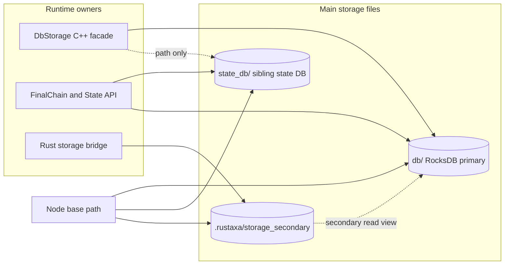
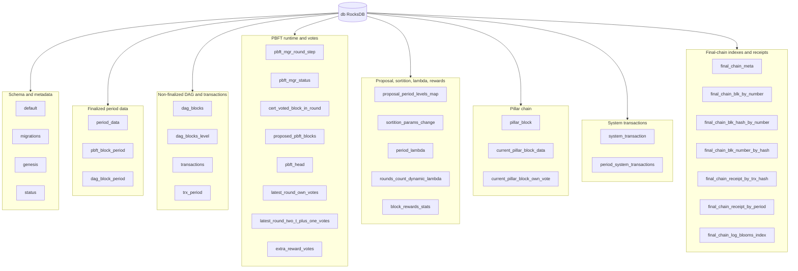
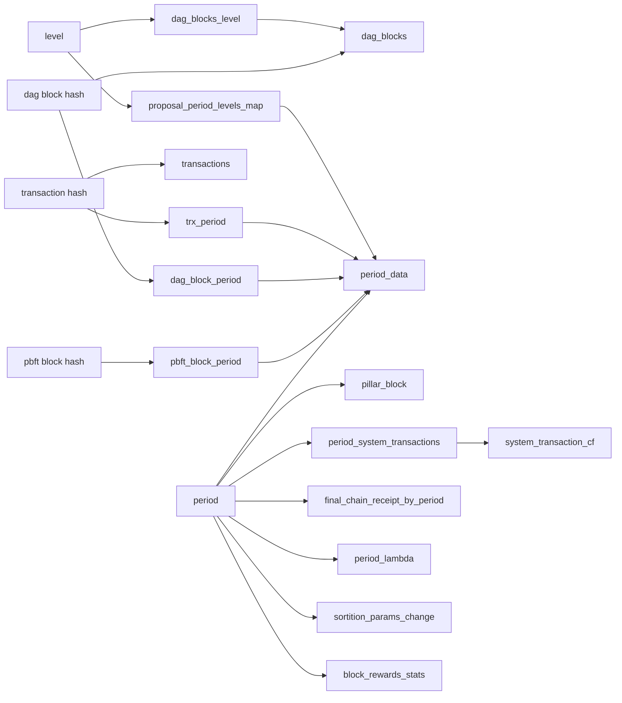
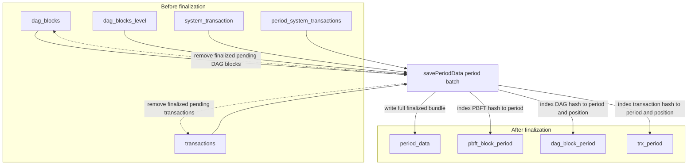
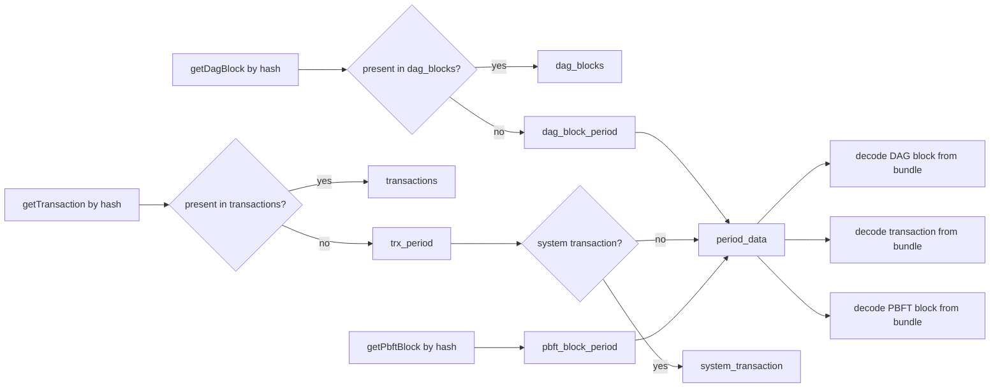
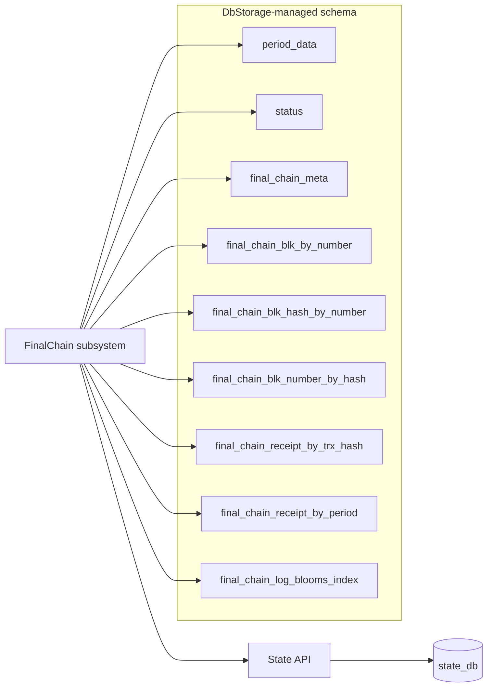
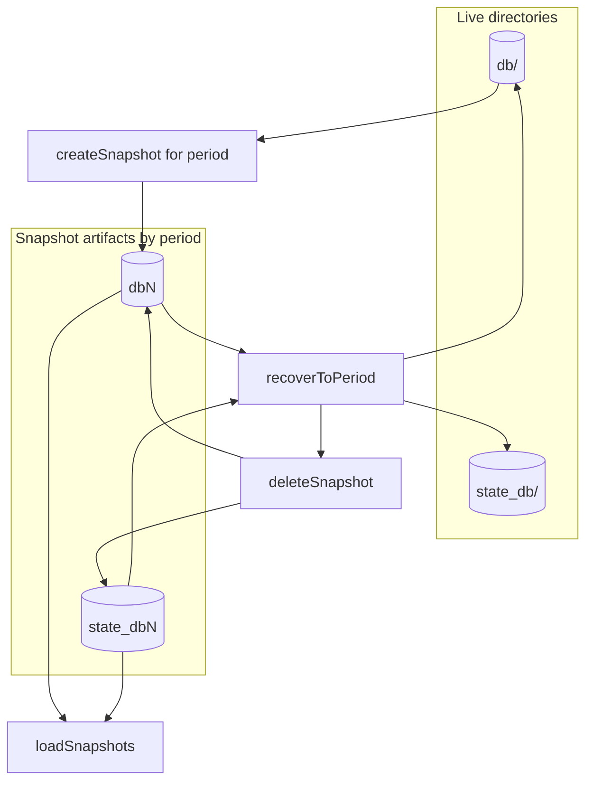
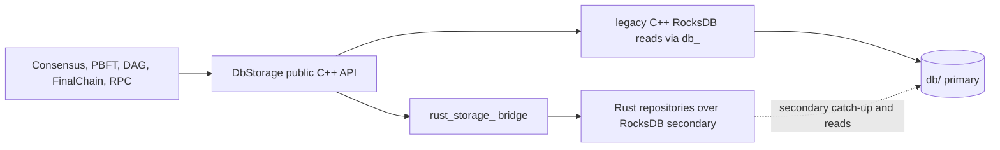

# Storage Schema Diagrams

This document visualizes the storage layout described in `doc/rewrite/storage_database_overview.md`.

These diagrams are meant to be architectural aids, not byte-accurate schema specifications. They show how the database is organized, how data flows through it, and how higher-level subsystems depend on it.

## Diagram 1: Physical Storage Layout

## Diagram 2: Full Column Family Map

## Diagram 3: Core Index Relationships

## Diagram 4: Pending to Finalized Lifecycle

## Diagram 5: Typical Read Paths

## Diagram 6: Final-Chain Relationship to DbStorage

## Diagram 7: Snapshot and Recovery Model

## Diagram 8: Rust Rewrite Insertion Point

Current implemented Rust repositories behind this insertion point:
- `DagRepository`
- `PeriodRepository`
- `PbftRepository` (currently used for `pbftBlockInDb` checks)

## Reading Order Suggestion

If you are trying to understand the storage module from scratch, the diagrams are easiest to consume in this order:

1. Physical storage layout
2. Full column family map
3. Pending to finalized lifecycle
4. Typical read paths
5. Final-chain relationship
6. Snapshot and recovery model
7. Rust rewrite insertion point

That sequence matches how the code is structured: first the database exists, then data is grouped, then it moves through the system, then higher-level subsystems consume it.
